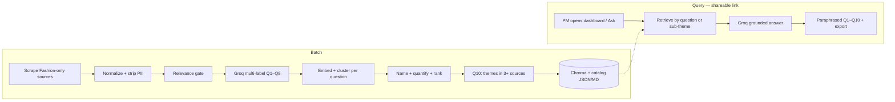
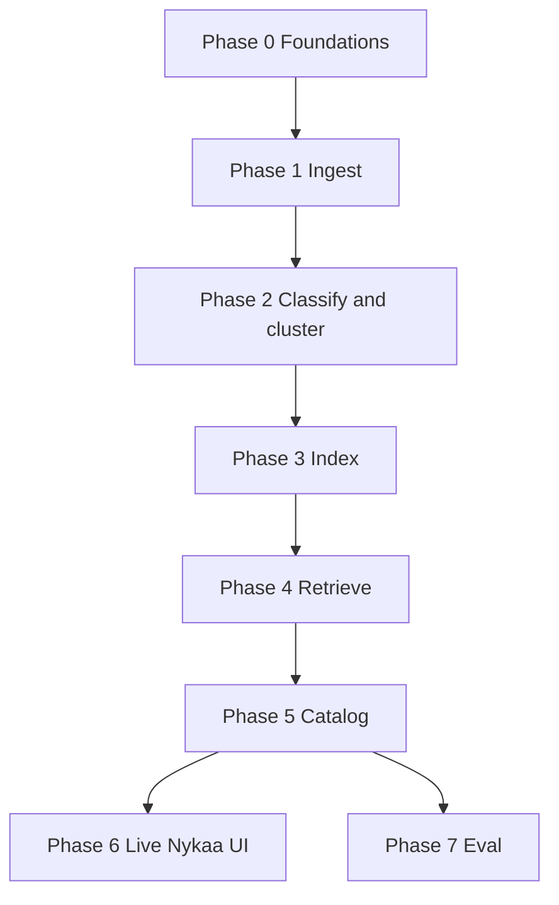
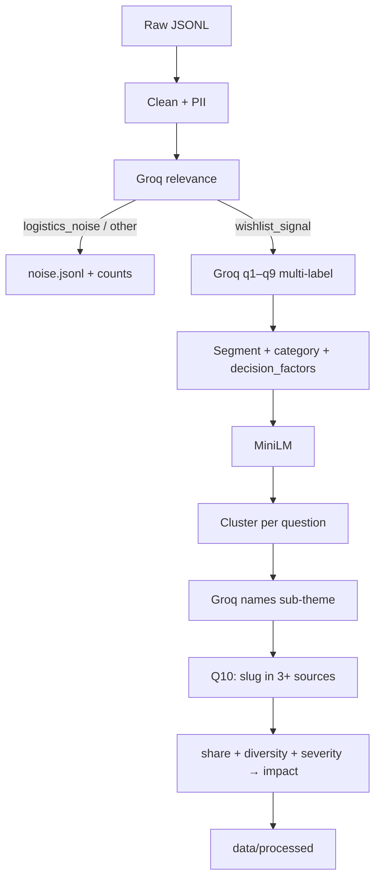

# Nykaa Fashion Wishlist Discovery Engine — Phased Implementation Plan

> **Plan only.** Do not treat this file as permission to implement. Product scope, KPI, Q1–Q10, sources, and success criteria are defined only in **[problemStatement.md](./problemStatement.md)**. If the two conflict, amend the problem statement first.

**Prior engine (reference, do not copy):** `NL_AIRDBlinkIT` is the same *family* of work — public-text ingest, local embeddings, Groq, FastAPI + React, Render + Vercel live link. That engine answered Blinkit *category expansion* (8 questions, keyword-ish themes, dark green/yellow UI). This engine answers **why Nykaa Fashion wishlist items fail to convert within 30 days** (10-question LLM taxonomy, relevance gate, ranked sub-themes, Nykaa visual identity). Reuse mechanics; rewrite questions, schema, prompts, corpus, and UI.

---

## 1. Document overview

| Field | Value |
|---|---|
| **Product** | Nykaa Fashion — Android `com.fsn.nds`, iOS `1439872423` |
| **Team** | Growth — wishlist-to-purchase |
| **KPI this engine informs** | ↑ % of users who purchase ≥1 wishlisted item within **30 days** of adding it |
| **Hard constraint** | No coupons, discounts, cashback, or price-cuts as the *mechanism* |
| **Core job** | Qualitative signal mining: classify public Nykaa Fashion language into Q1–Q10, name sub-themes, quantify, rank by impact on that KPI |
| **Not** | Star-rating dashboard, support chatbot, competitor teardown, or a reskinned Blinkit analyser |
| **LLM** | Groq — **batch** (relevance + Q1–Q9 classify + cluster naming) **and** query (cited catalog). Unlike the prior engine, classification cannot wait until ask-time. |
| **Embeddings** | `sentence-transformers/all-MiniLM-L6-v2` (local; never Groq) |
| **Vector store** | ChromaDB collection `nykaa_fashion_wishlist_v1` |
| **Live link** | FastAPI on Render + React on Vercel |
| **Problem statement** | [problemStatement.md](./problemStatement.md) |

### Requirements map

| Problem-statement requirement | Phase that owns it |
|---|---|
| Ingest Nykaa Fashion–only public text (§7.1, §8) | 1 |
| Normalize `{source, source_type, date, product_category, raw_text, url}` | 0 schema, 1 writers |
| Filter delivery/refund noise (§7.3) | 2 relevance gate |
| LLM classify into Q1–Q10, not keywords (§7.4, §6) | 2 classifier; Q10 computed |
| Named sub-themes per bucket (§7.5) | 2 cluster + name |
| Quantify share, source diversity, severity/frequency (§7.6) | 2 scoring |
| Segment / category tags for Q9 (§7.7) | 2 |
| Paraphrased evidence, no PII (§7.8, §9) | 1 strip, 5 paraphrase |
| JSON + Markdown Q1–Q10 report for Parts 2–4 (§7.9) | 5 |
| Live shareable, re-runnable link (§7.10, §10) | 6 |
| Nykaa look (logo, `#FC2779`, light listing UI) | 6 |

---

## 2. End-to-end architecture

Two paths: **batch** (GitHub Actions / CLI) and **query** (live UI).



| Step | What happens | Where | Demo need |
|---|---|---|---|
| 1 | Scrape | Actions / CLI | Gather |
| 2 | Normalize + PII strip | Actions / CLI | Common schema |
| 3 | Relevance: `wishlist_signal` vs `logistics_noise` vs `other` | Actions / CLI | Most Play reviews are not the problem |
| 4 | Groq assigns q1–q9 (multi-label) | Actions / CLI | Primary taxonomy |
| 5 | Cluster + LLM-name sub-themes | Actions / CLI | Named patterns |
| 6 | Quantify + impact-rank | Actions / CLI | Frequency / strength |
| 7 | Compute Q10 | Actions / CLI | Cross-source unmet needs |
| 8 | Embed + upsert | Actions / CLI | Scale |
| 9 | Retrieve | API | Evidence |
| 10 | Generate + paraphrase | API | Report for Parts 2–3 |
| 11 | Nykaa UI + export | Vercel + Render | Graded live link |

**Rules**

- Embeddings always MiniLM. Groq never in the browser. Secrets in `.env` / Actions / Render only.
- Keywords may **pre-filter recall** only. Final relevance and Q assignment are LLM JSON.
- Q10 is **never** assigned on a single document in the classifier prompt.
- Generated implications must not recommend making the item cheaper.
- Nykaa Beauty (`com.fsn.nykaa`) is **wishlist-UX cross-reference only**, tagged `nykaa_beauty_xref`, excluded from Fashion-primary counts unless the text is about shared account/wishlist infra.
- No Myntra, AJIO, or other competitor corpus ([problemStatement.md §9](./problemStatement.md)).

---

## 3. Design principles

1. **Classification-first** — the output taxonomy *is* Q1–Q10, not sentiment stars.
2. **Wishlist language, not logistics rage** — delivery/OTP/refund without save/hesitation speech is counted as noise, not mixed into buckets.
3. **Hypotheses, not conclusions** — ranked list for Part 3 interviews.
4. **Paraphrase in the product** — store `chunk_id` internally; UI and deck show paraphrases.
5. **Source-agnostic schema** — one document model for stores, Reddit, hauls, complaint sites.
6. **Nykaa, not generic RAG chrome** — light canvas, magenta wordmark, peach→pink utility bar (see Phase 6).
7. **Show the workflow** — each phase writes `data/` artifacts and a summary JSON.

---

## 4. Technology stack (locked for this plan)

| Layer | Choice | Home when built |
|---|---|---|
| Scheduler | GitHub Actions | `.github/workflows/ingest.yml` |
| Language | Python 3.11+ | `src/` |
| Play Store | `google-play-scraper` | `src/ingestion/adapters/play_store.py` |
| App Store | iTunes customer-reviews RSS | `src/ingestion/adapters/app_store.py` |
| Reddit | Public search API (e.g. PullPush / PRAW as ToS allows) | `src/ingestion/adapters/reddit.py` |
| Forums / Trustpilot / MouthShut | Official/public feeds only; else defer | `src/ingestion/adapters/forum.py` |
| YouTube comments | Data API v3 if `YOUTUBE_API_KEY` | `src/ingestion/adapters/youtube.py` |
| Twitter / X, Quora, login walls | **Deferred V1** — document in README | — |
| Relevance + classify + names | Groq structured JSON | `src/processing/` |
| Embed + cluster | MiniLM + agglomerative / HDBSCAN | `src/processing/cluster.py`, `src/indexing/` |
| Vector DB | Chroma | `data/chroma/` |
| Retrieval | Vector + `research_questions` / `sub_theme_id` filters | `src/retrieval/` |
| Catalog generation | Groq + stub if no key | `src/generation/` |
| API | FastAPI | `src/api/` |
| UI | React + Vite + Tailwind | `frontend/` |
| Tests | pytest | `tests/` |

---

## 5. Phase map

| Phase | Name | Outcome | Depends on |
|---|---|---|---|
| **0** | Foundations | Config, schema, 10-Q catalog, prompts, brand tokens, empty tree | — |
| **1** | Ingestion | Raw Nykaa Fashion corpus under `data/raw/` | 0 |
| **2** | Relevance, classify, cluster, quantify | Q-tagged chunks + named sub-themes | 1 |
| **3** | Index | Chroma collection | 2 |
| **4** | Retrieval | Top-K packs per question | 3 |
| **5** | Catalog generation | JSON + Markdown for all 10 questions | 4 |
| **6** | Nykaa UI + live link | Third party can open URL, inspect Q1–Q10, export | 5 |
| **7** | Validation | Relevance + classification labels, 10/10 coverage notes | 5+ |



---

## Phase 0 — Foundations and contracts

**Goal:** Freeze schema, sources, the 10-question catalog, classification prompts, and brand tokens before any scraper.

### Tasks

| # | Task | Output |
|---|---|---|
| 0.1 | Repo tree as in §12 (`config/`, `src/`, `data/`, `frontend/`, `tests/`, `.env.example`, `.gitignore`) | Empty modules + ignore rules |
| 0.2 | `config/sources.yaml` — Play `com.fsn.nds`, App `1439872423`, Reddit subs §8C, optional Beauty xref `com.fsn.nykaa`, competitor blocklist | Source inventory |
| 0.3 | `config/constraints.yaml` — 12-month window (24 fallback), caps, language, corpus target, PII patterns | Constraint contract |
| 0.4 | `config/queries.yaml` — all **10** questions + 1–2 paraphrases each | Query catalog |
| 0.5 | Document + chunk + sub-theme + catalog JSON schemas | `docs/schema.md` + `src/models/` |
| 0.6 | Relevance, classifier, cluster-name, generate prompts | `config/prompts.yaml` |
| 0.7 | Brand tokens from live Nykaa UI (Phase 6 table) | `config/brand.yaml` or CSS contract in docs |
| 0.8 | Eval rubric: relevance precision, multi-label Jaccard, citation, 10/10 coverage | `docs/eval-rubric.md` |
| 0.9 | `requirements.txt` + README stub (setup only) | Runnable env when implementation starts |

### Query catalog (must ship — from problem statement §6)

1. Why do users add fashion products to their wishlist?
2. What prevents wishlisted products from eventually being purchased?
3. What uncertainties remain after users have identified a product they like?
4. What causes users to postpone a purchase?
5. How do users compare multiple shortlisted products?
6. What information do users seek outside Nykaa Fashion before purchasing?
7. What role do fit, size, styling, price, reviews, occasion, and social validation play?
8. When is the wishlist genuine purchase intent vs. pure bookmarking?
9. How do these behaviors differ across user segments?
10. What unmet needs emerge consistently across many independent sources?

IDs: `q1_wishlist_motive` … `q10_unmet_needs`. Q10 flagged `computed: true`.

### Unified document schema

Required by [problemStatement.md §7](./problemStatement.md):

```json
{
  "id": "uuid",
  "source": "play_store | app_store | reddit | trustpilot | mouthshut | youtube | forum | blog | social | nykaa_beauty_xref",
  "source_type": "app_review | community | video_comment | complaint | article",
  "date": "ISO-8601",
  "product_category": "ethnic | western | footwear | accessories | jewellery | beauty_crossover | unknown",
  "raw_text": "anonymized body",
  "url": "permalink",
  "rating": null,
  "platform": "ios | android | web | unknown",
  "relevance": "wishlist_signal | logistics_noise | other",
  "research_questions": ["q2_conversion_blockers", "q3_uncertainties"],
  "sub_theme_ids": ["q3_uncertainties_sizing_runs_small"],
  "segment_hint": "first_time | repeat | price_sensitive | occasion_shopper | unknown",
  "decision_factors": ["fit", "size", "styling", "price", "reviews", "occasion", "social_validation"],
  "intent_label": "purchase_intent | bookmark | unclear",
  "content_hash": "sha256",
  "pii_stripped": true
}
```

Short reviews = one chunk. Long threads ≈ 350 words, 50 overlap. Chunks inherit question ids, sub-themes, segment, source, url, date.

### Sub-theme schema

```json
{
  "sub_theme_id": "q3_uncertainties_sizing_runs_small",
  "question_id": "q3_uncertainties",
  "name": "Sizing runs small",
  "share_of_bucket": 0.31,
  "source_diversity": 4,
  "sources": ["play_store", "reddit", "youtube", "app_store"],
  "frequency": "high",
  "severity": "high",
  "impact_rank": 1,
  "impact_score": 0.82,
  "paraphrased_examples": ["Users like a kurta, then hesitate because reviews say the chart runs small."],
  "hypothesis": "Fit uncertainty after save is a primary 30-day blocker in ethnic wear.",
  "interview_probes": ["Walk me through the last saved item you did not buy — what were you still unsure about?"],
  "chunk_ids": ["..."]
}
```

### Classifier prompt contract (`config/prompts.yaml`)

**Relevance (batch):** Label `wishlist_signal` if the text is about saving, shortlist, fit/quality/colour/authenticity doubt *after liking*, postponing a buy, comparing saved items, checking Instagram/YouTube/friends before buying, or bookmark vs intent. `logistics_noise` if delivery, refund, OTP, crash, packaging with **no** decision/wishlist language. Else `other`. JSON only.

**Q assignment (batch):** Zero or more of q1–q9 using the official table in problem statement §6. Multi-label allowed. **Do not output q10.** Do not invent segments. Do not treat competitor-only rants as in-scope. If logistics-only, it should not have reached this prompt. JSON: `research_questions`, `confidence`, `decision_factors`, `segment_hint`, `product_category`, `intent_label`, `rationale`.

**Generate (query):** Answer only from excerpts + sub-theme stats. Cite `[chunk_id]` internally; user-facing text is paraphrased. Rank by impact on 30-day wishlist purchase. **Never** recommend coupons/discounts/cashback/price-cuts. Separate observed vs hypothesis. Add interview probes.

Few-shots: synthetic, one per question — not verbatim scraped reviews.

### Exit criteria

- [x] Config files listed above exist (`config/*.yaml`)
- [x] Schema + 10-Q catalog + prompts reviewed against problem statement
- [x] Brand tokens locked (`config/brand.yaml`)
- [x] V1 source priority written: stores first, then Reddit, then ToS-safe forums/YouTube

---

## Phase 1 — Multi-source ingestion

**Goal:** Public **Nykaa Fashion** text into `data/raw/{source}/{date}/documents.jsonl`. Demonstrates how the workflow gathers data.

### Source rollout

| Priority | Source | Adapter | V1 |
|---|---|---|---|
| P0 | Play Store `com.fsn.nds` | `play_store.py` | Required |
| P0 | App Store `1439872423` | `app_store.py` | Required |
| P1 | Reddit §8C + search queries | `reddit.py` | Required once stores work |
| P1 | Trustpilot / MouthShut / consumercomplaints — only if ToS/robots allow | `forum.py` | Recommended or defer + README |
| P1 | YouTube comments via Data API, search terms in §8D | `youtube.py` | If API key; else skip |
| P2 | Nykaa Beauty Play `com.fsn.nykaa` wishlist-UX xref | tagged origin | Optional |
| Deferred | Twitter/X, Quora, authenticated pages | — | Known limitation |

### Constraints (code, not hope)

| Rule | Value |
|---|---|
| Window | 12 months; 24 if under 40/source or total under target |
| Target | ≥400 **relevant** (post-gate) docs; cap ~600 raw |
| Caps (draft) | Play 220, App 80, Reddit 150, forum 80, YouTube 70 |
| Language | Prefer English ≥0.9; log Hinglish as limitation |
| Length | 20–2000 chars, ≥4 words |
| Dedup | `content_hash` + near-dup cosine > 0.95 |
| PII | Strip emails, phones, order IDs, `@handles` before save |
| Competitors | Drop docs whose primary subject is Myntra/AJIO/etc. unless Nykaa Fashion is also the subject |
| Login | Do not scrape |

**Keyword list** (recall prefilter only): wishlist, saved, shortlist, size, fit, fabric, colour, haul, occasion, haven't bought, waiting, compare, Instagram, bookmark, cart, kurta, ethnic, …

CLI: `python -m src.ingestion`. Log `data/raw/_logs/{date}/ingestion_summary.json` (fetched / kept / drop reasons).

### Exit criteria

- [x] ≥2 live sources (Play + App)
- [x] Filter stats explain drops
- [x] No secrets in git
- [x] Deferred sources listed as limitations

---

## Phase 2 — Relevance, Q1–Q9 classify, cluster, quantify

**Goal:** This is the engine’s core job ([problemStatement.md §4–§7](./problemStatement.md)).



### Relevance

| Label | Fate |
|---|---|
| `wishlist_signal` | Classifier |
| `logistics_noise` | Keep counts; show “filtered” in UI; **not** in Q1–Q10 |
| `other` | Drop from analysis |

Batch short reviews per Groq call. Cache by `content_hash`. Temperature ~0.1.

### Classification

Multi-label q1–q9. Empty list + `low` confidence allowed (residual). Q9 only when segment/category is **inferable**. Q7 when any of the six factors are explicit. Price as a *decision factor* is in scope; discounts as a *solution* are out of scope in Phase 5.

### Clustering

Per q1–q9: embed bucket → agglomerative cosine (distance ~0.35, min size 3) → leftovers `{qN}_other` → Groq names `{name, slug, severity}` from 8–12 members → `sub_theme_id = {question_id}_{slug}`.

**Q10:** Sub-themes (or explicit asks) appearing in **≥3 independent sources** among `{play_store, app_store, reddit, forum, youtube, …}`. A theme may appear under its home Q **and** Q10.

### Quantification and ranking

| Metric | Definition |
|---|---|
| `share_of_bucket` | docs in sub-theme / docs in that Q |
| `source_diversity` | distinct `source` values |
| `frequency` | high/medium/low from tertiles **within the bucket** |
| `severity` | LLM qualitative (fit/trust/friction) — not star rating |
| `impact_score` | `0.4 * share_norm + 0.3 * (diversity / N_sources) + 0.3 * severity_num` |

Rank **within each question** by `impact_score`. Impact = potential effect on **30-day wishlist purchase**, not who yelled about delivery.

Outputs: `documents.jsonl`, `chunks.jsonl`, `sub_themes.json`, `processing_summary.json`, `noise_summary.json`.

### Exit criteria

- [x] Majority of `wishlist_signal` docs have ≥1 of q1–q9
- [x] Each of Q1–Q9 has ≥1 named sub-theme **or** explicit `data_gap`
- [x] Q10 derived from 3+ source overlap
- [x] Noise counted and visible
- [x] No PII in processed files meant for UI

---

## Phase 3 — Embed and index

| Item | Value |
|---|---|
| Model | MiniLM L6 v2, 384-d, cosine |
| Collection | `nykaa_fashion_wishlist_v1` |
| Metadata | source, research_questions, sub_theme_ids, segment_hint, product_category, relevance, date, url, chunk_id |
| Upsert | Idempotent by `chunk_id` |

Smoke: retrieve all 10 catalog questions; fail CI if ≥8/10 empty (Q10 may be thin early).

Outputs: `data/chroma/`, `data/index/{date}/indexing_summary.json`.

### Exit criteria

- [x] MiniLM 384-d cosine (stub hash vectors allowed in CI)
- [x] Collection `nykaa_fashion_wishlist_v1`, upsert by `chunk_id`
- [x] Metadata: source, questions, sub-themes, segment, category, relevance, date, url, chunk_id
- [x] Smoke all 10 catalog questions; fail if ≥8/10 empty
- [x] `indexing_summary.json` written

---

## Phase 4 — Retrieval

| Question | Strategy |
|---|---|
| Q1–Q8 | Metadata filter `research_questions` contains that id |
| Q7 | Optional `decision_factors` filter |
| Q8 | Also `intent_label` |
| Q9 | Stratify `segment_hint` and `product_category` |
| Q10 | Q10 sub-themes + `source_diversity >= 3` |

Cap ~60% from one source. Empty → `data_gap`. CLI: `python -m src.retrieval --catalog`. Packs: `data/retrieval/{date}/{query_id}.json`.

### Exit criteria

- [x] Q1–Q8 filtered by question id; Q7 prefers decision factors; Q8 mixes intent; Q9 stratifies segment/category
- [x] Q10 only from sub-themes with `source_diversity >= 3`
- [x] Source cap ~60% when alternatives exist
- [x] Empty packs flagged `data_gap`
- [x] `--catalog` writes per-question JSON

---

## Phase 5 — Catalog generation (JSON + Markdown)

**Goal:** Output clean enough for Part 2 metric decomposition and Part 3 interview guide.

Groq: `llama-3.3-70b-versatile`, temperature 0.2, top 10 classified chunks + sub-theme rollup. Retry once; else retrieval stub.

Lint: reject output that recommends coupons/discounts/cashback/price-cuts.

### Catalog object

```json
{
  "generated_at": "ISO-8601",
  "kpi": "wishlist_to_purchase_30d",
  "corpus": { "relevant": 0, "noise": 0, "sources": {} },
  "questions": [
    {
      "id": "q1_wishlist_motive",
      "question": "Why do users add fashion products to their wishlist?",
      "summary": "...",
      "sub_themes": [],
      "implications": [],
      "interview_probes": [],
      "confidence": "high | medium | low",
      "data_gaps": "..."
    }
  ]
}
```

Files: `data/responses/{date}/catalog_summary.json`, `catalog_summary.md`, plus per-question JSON. Success criterion: **at least one quantified, evidence-backed section per Q1–Q10** (or explicit gap).

### Exit criteria

- [x] Groq generate (temp 0.2) with retry-once; else retrieval stub
- [x] Lint rejects coupons/discounts/cashback/price-cuts as the mechanism
- [x] `catalog_summary.json` + `catalog_summary.md` + per-question JSON
- [x] All 10 questions have a quantified section **or** explicit `data_gap`
- [x] User-facing examples paraphrased (no verbatim review dumps)

---

## Phase 6 — Interface and live link (Nykaa visual identity)

**Goal:** Graded deliverable — someone else opens a URL, reads ranked sub-themes, exports.

**Frontend is React.** Do not ship Streamlit, Next.js, Vue, or a static HTML report as the live interface.

| Item | Choice |
|---|---|
| Framework | **React 18+** (functional components) |
| Bundler | **Vite** |
| Styling | **Tailwind CSS** |
| Icons | Lucide React |
| Location | `frontend/` |
| Dev | `cd frontend && npm install && npm run dev` → `http://127.0.0.1:5173` |
| API proxy | Vite `/api` → FastAPI `:8000` |

### Brand (from live Nykaa web UI, not from the Blinkit analyser)

| Token | Hex / value | Use |
|---|---|---|
| Pink | `#FC2779` | **NYKAA** wordmark, primary CTAs, active nav underline, “FEATURED”-style Q labels |
| Pink hover | `#E01B68` | Button hover |
| Promo bar | `#FFC4A8` → `#FC2779` | Top utility strip (peach → pink, as on nykaa.com) |
| Canvas | `#F7F7F7` | Page behind content (listing grey) |
| Surface | `#FFFFFF` | Header, panels |
| Ink | `#001325` | Titles and nav (near-black) |
| Muted | `#6F6F6F` | Meta, counts |
| Hairline | `#E8E8E8` | Borders |
| Search fill | `#F3F3F3` | Ask field, like “Search on Nykaa” |
| Radius | 8–12px on panels; **pill CTAs** only where Nykaa uses “Shop Now” pills | |

**Logo:** Magenta italic-caps **NYKAA** wordmark (same weight as site header). No Blinkit bolt, no dark theme, no yellow/green.

**Type:** Distinctive wordmark + fashion sans for UI (not Inter / Roboto / Arial).

**Layout (Nykaa listing energy, not a metric dashboard in the first viewport)**

1. Peach→pink utility bar.
2. White header: wordmark left; black text nav (Pipeline, Research Qs, Themes); grey search-like Ask; pink pill CTA (Export).
3. **Hero (one composition):** brand-level NYKAA, one headline on 30-day wishlist conversion, one sentence, one CTA. Optional full-bleed fashion/listing photography. No stat strip, no Q-cards, no floating badges on the image.
4. Below the fold: pipeline, then **10 research-question panels** (click → ranked sub-themes + paraphrases), then sub-theme explorer, then footer export.

**API (browser never holds Groq key)**

```
GET  /api/v1/health
GET  /api/v1/pipeline/summary
GET  /api/v1/catalog
GET  /api/v1/themes
GET  /api/v1/insights/{query_id}
POST /api/v1/ask
POST /api/v1/export
```

**Deploy**

| Surface | Host | Notes |
|---|---|---|
| FastAPI | Render (`render.yaml`, `Dockerfile`) | Cold start OK if catalog is cached |
| React | Vercel (`frontend/`, `VITE_API_BASE_URL`) | SPA rewrite |

Ship `data/responses` (and index if needed) in git so the live link works without re-scraping on a free host. CORS: `FRONTEND_ORIGINS` + `ALLOW_VERCEL_ORIGINS=1`.

### Exit criteria

- [ ] Public URL; third party can export Q1–Q10 — **local UI + export work; Render/Vercel configs shipped.** Paste the Vercel URL here after you deploy ([docs/phase6.md](./docs/phase6.md)).
- [x] UI is recognisably Nykaa (pink wordmark, light listing chrome)
- [x] No Groq secrets in the frontend bundle

---

## Phase 7 — Validation

**Status:** gold + harness shipped. Stub run 2026-08-30: precision / Jaccard / citations / 10/10 coverage / lint / p95 Ask all meet target. Relevant corpus 13 ≪ 400. Public URL not set. Details: [docs/phase7.md](./docs/phase7.md).

| Metric | Target |
|---|---|
| Relevance precision (wishlist vs logistics) | ≥ 0.85 on a labeled sample |
| Q-classification Jaccard / multi-label | ≥ 0.75 on ~40 gold rows |
| Citation accuracy | ≥ 90% |
| Question coverage | 10/10 sections |
| Live link | Third party open + export |
| Latency p95 `/query` (`/api/v1/ask`) | < 5s (cached catalog instant) |

Golden set: 10 questions × 2 paraphrases; 20 relevance labels (10 noise / 10 signal). Document Hinglish, delivery-dominated Play reviews, sparse Q5/Q6/Q8, missing YouTube key, deferred X/Quora.

CLI: `python -m src.eval --stub` → `data/eval/{date}/eval_summary.json`.

---

## 6. GitHub Actions (when implementation starts)

```yaml
# outline only — .github/workflows/ingest.yml
name: Ingest Classify Index Nykaa Fashion
on:
  schedule:
    - cron: '0 6 */10 * *'
  workflow_dispatch:
jobs:
  pipeline:
    runs-on: ubuntu-latest
    steps:
      - uses: actions/checkout@v4
      - uses: actions/setup-python@v5
        with:
          python-version: '3.11'
      - run: pip install -r requirements.txt
      - run: python -m src.ingestion
      - run: python -m src.processing   # needs GROQ_API_KEY
      - run: python -m src.indexing
```

Query path stays off the cron unless a catalog smoke step is added. **Enabled:** `.github/workflows/ingest.yml` runs every ~10 days at 06:00 UTC (`workflow_dispatch` too), then stub index + catalog refresh committed to `data/responses/`.

---

## 7. Output consumers

| Artifact | Consumer |
|---|---|
| `catalog_summary.json` | Part 2 metric decomposition |
| `catalog_summary.md` | Deck + Part 3 discussion guide |
| Per-question JSON | Deep dives |
| `POST /api/v1/export` | Anyone with the live link |

Each question: ranked named sub-themes, share, source diversity, frequency/severity, paraphrases, hypothesis, interview probes, confidence, data_gaps.

---

## 8. Risk register

| Risk | Mitigation |
|---|---|
| Play reviews 90% delivery | LLM relevance gate; Reddit + haul comments for decision language |
| Keyword classification | Forbidden as assignment; keywords = recall only |
| ToS blocks Trustpilot/X | Official APIs first; defer and document |
| Sparse Q5/Q6/Q8 | Community sources; honest `data_gap` |
| Groq cost | Classify `wishlist_signal` only; hash cache |
| PII / verbatim in deck | Strip at ingest; paraphrase at generate |
| Model recommends discounts | System prompt + output lint |
| Competitor leakage | Blocklist + Fashion-only config |
| Looks like Blinkit | Phase 6 brand contract; light + `#FC2779` wordmark |

---

## 9. Definition of done (V1)

1. Pipeline: gather → filter → LLM q1–q9 → cluster → quantify → Q10 → index → catalog.
2. Live Vercel (+ Render) link; export works for a third party.
3. All **10** questions have a quantified, evidence-backed section or an explicit gap.
4. Sub-themes named, ranked, paraphrased, source-diverse.
5. Logistics noise counted separately.
6. No competitor corpus, no login scrapes, no PII in UI.
7. Implications never use monetary incentives.
8. Dashboard reads as **Nykaa Fashion**, not a dark generic RAG console.

---

## 10. Implementation order (when asked)

Phase 0 → 1 (Play + App) → 2 (the differentiator) → 3–5 (index, retrieve, catalog) → 6 (Nykaa UI + live link) → 7 (labels). Do not start Part 2 solution design until this engine produces the ranked hypothesis list.

---

## 11. Timeline (planning estimate)

| Week | Phases | Milestone |
|---|---|---|
| 1 | 0 → 1 start | Contracts + store scrapers |
| 2 | 1 → 2 | Relevant corpus; Q buckets + sub-themes |
| 3 | 3 → 5 | Index; 10-question catalog |
| 4 | 6 | Nykaa dashboard + public URL |
| 5 | 7 + polish | Validation notes; deferred-source README |

---

## 12. Target repository layout

Empty directories are reserved now; **no application code until implementation is requested.**

```
NAYKAA_AiDISCOVERY/
├── problemStatement.md          # canonical product brief
├── architecture.md              # this plan
├── README.md                    # pointers only
├── .gitignore
├── docs/                        # schema, eval rubric, deploy notes (when written)
├── config/                      # sources, constraints, queries, prompts, brand
├── src/
│   ├── models/
│   ├── ingestion/adapters/
│   ├── processing/
│   ├── indexing/
│   ├── retrieval/
│   ├── generation/
│   ├── api/
│   └── eval/
├── data/
│   ├── raw/
│   ├── processed/
│   ├── chroma/
│   ├── index/
│   ├── retrieval/
│   ├── responses/
│   └── eval/
├── frontend/                    # React app (Phase 6)
├── tests/
└── .github/workflows/           # ingest.yml (Phase 1–3)
```

Root includes `requirements.txt`, `requirements-api.txt`, `.env.example`, `Dockerfile`, `render.yaml`.
